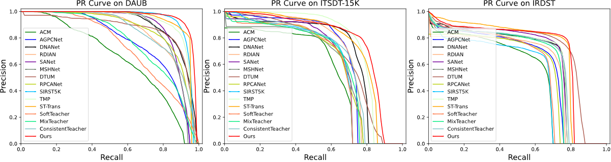

# S2MVP
The official repository for the paper "Semi-supervised Multi-view Prototype  Learning with Motion Reconstruction for Moving Infrared Small Target Detection"

Our paper is accepted to "IEEE Trans. on Geoscience and Remote Sensing (TGRS)".

Currently, it is still in the process of refinement. After the formal publication of the paper, the code will be further improved.


## Introduction
Moving infrared small target detection is critical for various applications, e.g., remote sensing and military. Due to small target size and limited labeled data, accurately detecting targets is highly challenging. Currently, existing methods mainly focus on fully-supervised learning, which greatly depends on a large number of annotated frames for training. However, annotating numerous frames for each video is expensive, time-consuming, and often redundant, especially for low-quality infrared images. To break through traditional fully-supervised framework, on unlabeled data, we propose a new semi-supervised multi-view prototype (S2MVP) learning scheme with motion reconstruction. In our scheme, a bi-temporal motion perceptor based on bidirectional ConvGRU cells is designed to adequately model the motion paradigms of targets via both forward and backward perceiving. Moreover, to explore the potential of unlabeled data, it generates some multi-view feature prototypes of targets as soft labels to guide feature learning by calculating cosine similarity. Imitating human visual system, it only remembers the feature prototypes of recent frames. Furthermore, it eliminates noise labels to improve the quality of pseudo-labels through the anomaly-driven pseudo-label filtering. Besides, we further design a target-aware motion reconstruction loss to provide additional supervision, avoiding target detail losing. To our best knowledge, the proposed S2MVP is the first work to utilize large-scale unlabeled video frames for detecting moving infrared small targets. Although 10\% labeled training samples are used, the experiments on three public benchmarks (DAUB, ITSDT-15K and IRDST) verify the superiority of our scheme to other compared methods.

## Requirements
- python == 3.8
- mmdet == 3.3.0
- mmcv == 2.0.0
- mmengine == 0.10.4
- pytorch == 2.0.0
- opencv-python == 4.10.0.84
- Tested on Ubuntu 20.04.6, with CUDA 12.0, and 1x NVIDIA 4090(24 GB)

### Notes
1. The code is based on [mmdetection](https://github.com/open-mmlab/mmdetection). Please follow the instructions in the original repository to install the dependencies.
2. The original code based on mmdetection could only process single-frame image. You need to modify the following main files to process multi-frame.
- a. mmdet/models/necks/fpn.py
- b. mmdet/models/backbones/resnet.py
- c. mmdet/models/detectors/fcos.py
- d. mmdet/models/detectors/single_stage.py
- e. Data augmentation-related files, e.g., Resize, Flip,… 

## Results


## Data Preparation
- You can download them directly from the website: [DAUB](https://www.scidb.cn/en/detail?dataSetId=720626420933459968), [ITSDT-15K](https://www.scidb.cn/en/detail?dataSetId=de971a1898774dc5921b68793817916e&dataSetType=journal), [IRDST](https://xzbai.buaa.edu.cn/datasets.html). You can also directly download the organized version of our paper. [ITSDT-15K](https://drive.google.com/file/d/1nnlXK0QCoFqToOL-7WdRQCZfbGJvHLh2/view?usp=sharing). 
- We provide a randomly divided 10% training set on three datasets.
- You can also generate a new ratio training set by yourself.
```
python tools/misc/split_daub.py
```

## Usage

### Train
```
CUDA_VISIBLE_DEVICES=0 python tools/train.py --config <config file> 
```
### Test
```
CUDA_VISIBLE_DEVICES=0 python tools/test.py <config file> <checkpoint>
```
### Inference
```
python demo/image_demo.py <config file> <checkpoint> <image path>
```
## Contact
IF any questions, please contact with Weiwei Duan via email: [dwwuestc@163.com]().
## References
- Chen, K., Wang, J., Pang, J., Cao, Y., Xiong, Y., Li, X., ... & Lin, D. (2019). MMDetection: Open mmlab detection toolbox and benchmark. arXiv preprint arXiv:1906.07155.
- Chen, Z., Zhang, W., Wang, X., Chen, K., & Wang, Z. (2023). Mixed pseudo labels for semi-supervised object detection. arXiv preprint arXiv:2312.07006.


